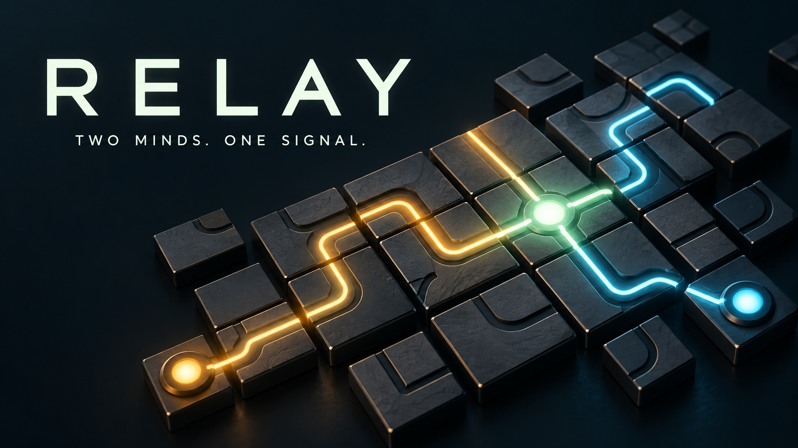
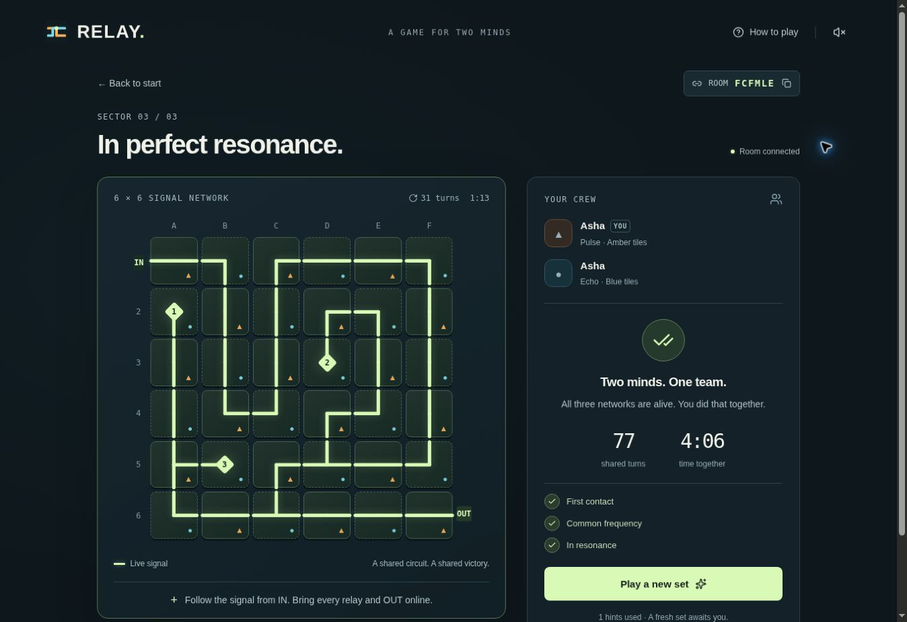

# Relay

**You own half the circuit. Your partner owns the rest.**

A cooperative puzzle for **two players on separate devices**. Rotate your tiles, guide your teammate, and bring a shared signal network to life. Built by **Inayat Abbas Malla** with ChatGPT Work for the Handshake AI Skills Studio Multiplayer Game Challenge.

**[Play Relay →](https://relay-together.inayat121786.chatgpt.site)** · [Project showcase](https://inayat1472.github.io/relay-multiplayer/) · [How to play](#how-to-play) · [Run locally](#run-locally) · [Deployment](DEPLOYMENT.md)

| Players | Challenge | Getting started |
| --- | --- | --- |
| 2 per room; solo practice available | 3 sectors: 4×4 → 5×5 → 6×6 | Open a link. Choose a name. No account required. |

## How to play

1. **Create a room** and share its invitation link or code with one friend. Join from separate devices, or use separate browser tabs for a quick test.
2. **Choose your part.** The creator is Pulse (amber triangles); the joining player is Echo (blue circles). Both players press Ready to begin.
3. **Rotate your tiles** 90° clockwise by clicking or tapping them. Select a teammate's tile to ping it. Quick signals and shared hints help you coordinate.
4. **Connect IN to every numbered relay and OUT at the same time.** Connected wires glow mint. Unused wires do not all need to be powered.
5. **Complete all three sectors.** Both players agree before advancing or starting a fresh set.

There is no countdown or failure penalty. The timer records time together. Learn the controls on a smaller 3×3 solo practice board, where you control both roles.

**Keyboard:** use arrow keys to move between tiles and Enter or Space to rotate or ping. Ownership uses shapes as well as color. Optional sound and reduced-motion support keep the experience adjustable.

## In play



The screenshot shows an actual playtest. The cover illustration is promotional artwork, not a gameplay screenshot.

## Why cooperation matters

Neither player can rotate the whole board. A useful move can belong to your partner, so observation and communication are part of the puzzle. Room state is shared through the server: refreshing a page does not create a separate game.

- Procedural circuits come with a verified reference solution.
- Approximately one-second polling keeps visible tabs in sync; background tabs poll more slowly.
- Shared pings, fixed quick signals, and hints work without a separate chat service.
- Rooms survive reloads when the browser retains the player's seat credentials.
- Each room admits two seats. Additional groups can create separate rooms; the project does not claim unlimited hosting capacity.

## Architecture

| Layer | Implementation |
| --- | --- |
| Interface | React, TypeScript, CSS, accessible dialog primitives |
| App framework | Vinext / Vite with the Next.js App Router interface |
| Game engine | Pure TypeScript generation, signal traversal, ownership, and progression |
| Multiplayer API | Cloudflare Worker with server-authoritative actions |
| Persistence | Cloudflare D1; SQL migrations managed with Drizzle |
| GitHub Pages | Static project showcase in `docs/`; play links open the hosted multiplayer app |

The server authenticates seats using 256-bit bearer secrets and stores their hashes. Compare-and-swap revisions preserve simultaneous moves; a bounded recent-action list suppresses immediate duplicate delivery. Match and round identifiers reject stale actions. The client never receives the reference solution or generation seed.

Rooms expire after seven days. Expired rows are purged when another room is created.

## Run locally

Use **Node.js 22.13 or newer** and the pinned **pnpm 11.25.0**. Install dependencies from the repository root:

```sh
pnpm install --frozen-lockfile
pnpm build
```

Initialize a **fresh local database once**, using the generated Worker configuration:

```sh
pnpm exec wrangler d1 execute DB --local --config dist/server/wrangler.json --persist-to .wrangler/state --file drizzle/0000_amusing_spyke.sql
```

Then run the built app:

```sh
pnpm start
```

Open the local URL printed by Wrangler. For editing with hot reload, use `pnpm dev` (port 5173). Local D1 state stays in the ignored `.wrangler/` directory. The initial SQL file creates tables; do not reapply it to an initialized database. Later migrations should be applied in order.

The checked-in D1 identifier is a placeholder for local use. Running these commands does not provision or deploy a production database. See [DEPLOYMENT.md](DEPLOYMENT.md) for hosting boundaries.

## Verification

```sh
pnpm test
pnpm typecheck
pnpm build
```

- **Game tests:** 1,000 generated puzzles across supported board sizes, solvability, non-trivial starts, ownership, hints, round completion, and rematches.
- **Server tests:** the actual SQL schema and server logic against SQLite through a D1-shaped adapter; racing joins, concurrent readiness and moves, duplicate delivery, authorization, cross-origin rejection, expiry, pings, signals, all rounds, rematches, and stale actions.
- **Browser playtest of the original game:** two independently authenticated sessions, shared state, reload recovery, all three rounds, rematch, solo practice, keyboard controls, and a narrow viewport.

The SQLite adapter is not a substitute for hosted D1 testing. The playtest does not establish physical-device coverage, support across all browser engines, or production load capacity.

## Source map

| File | Purpose |
| --- | --- |
| `app/relay.tsx` | Lobby, circuit board, player controls, and synchronization |
| `lib/game.ts` | Puzzle generation and game rules |
| `lib/server.ts` | Authentication, room persistence, and concurrency |
| `app/api/rooms/` | Room API routes |
| `db/` and `drizzle/` | Database schema and migrations |
| `scripts/test-*.mjs` | Game and server regression checks |
| `docs/` | GitHub Pages showcase and project artwork |

## Credits and licensing

Created by Inayat Abbas Malla with ChatGPT Work. The project uses third-party packages and vendored code; their license notices remain in place. No project-wide open-source license has been selected. Publishing this repository does not replace the licenses of its dependencies.

See [VERIFICATION.md](VERIFICATION.md) for the export checks and their limits.
